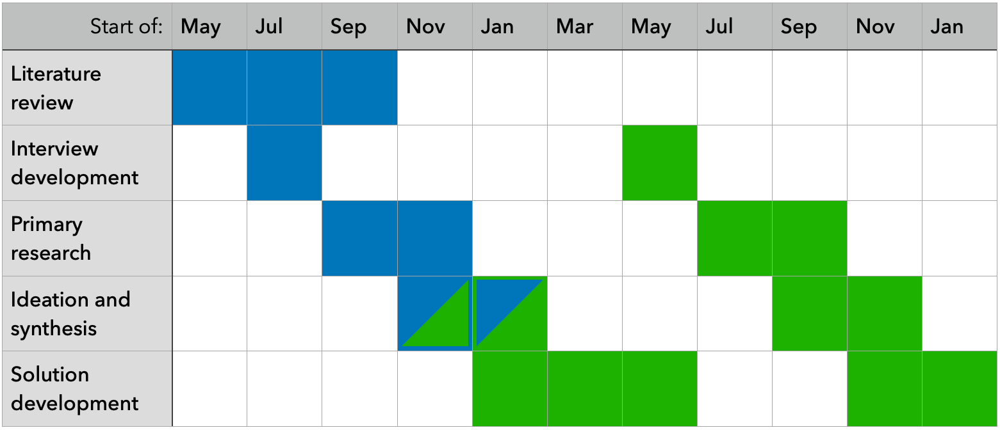

# Improving algorithm governance in the New Zealand public sector

Johniel Bocacao

April 2024

## 1. Introduction

As the use of algorithms to improve and optimise the operations of businesses increases and becomes increasingly effective, so too do government agencies. Use cases within the New Zealand Government range from simple business rules that triage applications, such as passport and visa applications. Other agencies employ more complex mathematical algorithms that influence how individual cases are handled, such as managing criminals more at risk of offending or targeting health support to improve patient outcomes. Algorithms may also inform policy and funding decisions with even more complex models that integrate data of individuals from different government agencies, such as evaluating the wider social outcomes of certain policy programmes. *(StatsNZ &amp; Affairs, 2018)* These algorithms help agencies make evidence-based decisions from the insights unlocked by modern data analytics, potentially reducing the inevitable subjectivity and risk of manual decisions made by humans that can be more prone to error and more difficult to systematically interrogate to understand what (such as biases) affects a decision they reach.

Algorithms are never perfect; it is not inevitable that algorithms will always improve outcomes. There is always a risk of algorithms making incorrect decisions to the detriment of individuals that, for example, miss health interventions after they were needed, or are victims of criminals already known to the justice system that were incorrectly managed. The importance of making accurate decisions is compounded for government agencies who have a monopoly on these services, from entry to the country to the legal use of force. Furthermore, a liberal democracy like New Zealand have processes that hold agencies accountable for decisions they make. These include hard levers like legislation that facilitate the right to information held by an agency, and enforce expectations on how individual information can be used to protect their privacy. There are more indirect soft levers like the risk of losing social license for agencies that consistently make suboptimal or incorrect decisions, to the point where certain communities could accuse an agency of bias against them, or make decisions that disproportionately restrict the rights of individuals. The general public may also hold concerns about the cold automatic nature of machine-based decisions, devoid of the intuition and empathy that comes from a human decision-maker. This risk of losing social license materialises in, for example, people becoming more hesitant to access government services, and are worse off as a result.

To maintain public confidence in how agencies operate and use individual data, the Government Chief Data Steward (role held by StatsNZ) and the Government Chief Digital Officer (role held by the Department of Internal Affairs) (hereafter both known as Joint System Leads) initiated work in 2018 to streamline the New Zealand Government's approach to "ensur[ing] algorithms are used appropriately, are used ethically, and free from bias" *(Milicich &amp; Occleshaw, 2018)*. A survey of government agencies determined how and why they used algorithms at the time to inform a set of principles the assure internal and external stakeholders that algorithms are fit for purpose and meet legal and ethical standards. These principles were embedded in the Algorithm Charter for Aotearoa New Zealand, a non-binding commitment by signatory agencies to comply with said principles, inculcated in each agency through enterprise policies and procedures. The full text is replicated in Section <a href="#80c5e210-ea41-11ee-9b93-53f888f67cff">2.3</a> below.

After 12 months, the Joint System Leads commissioned an independent review to evaluate if its intended aim of improving agency transparency was achieved, ensuring that they weren't stifled in terms of innovation or added compliance burdens. Aspects of the charter excluded from the review included reviewing the text and the voluntary nature of the charter. Findings from interviews and questionnaires were synthesised into common themes and actions, which have been picked up by StatsNZ to implement. This research aims to pick up where StatsNZ left off and seize opportunities to solve already identified gaps in the operationalisation of the Algorithm Charter. This research may also involve identifying opportunities to streamline algorithm development and governance in the New Zealand public sector in general, and critically evaluate how new technological and regulatory developments since the Charter's publication may affect how algorithm governance here should be approached.

### 1.1. Motivation

At the lowest level of the algorithm development process, the Algorithm Charter requires that "data is fit for purpose by understanding its limitations [and] identifying and managing bias". While this consideration will already be part of the processes of agencies with mature algorithm development capability, and may vary considerably depending on the nature of the business problem, there is a case for providing further guidance in operationalising this principle:

- A minimal standard set of fitness measures, both for the data and the algorithm where applicable, provides a consistent benchmark to readily assure stakeholders (from internal governance advisors to the general public) that an algorithm is fit for purpose.
- A gold standard for measuring fitness can help agencies early in their algorithm maturity to embed best practices during model development and governance.
- Clarifying the importance for monitoring algorithms on an ongoing basis can ensure the data and algorithm continues to be fit for purpose and bias is managed. The importance of regular peer review is acknowledged in the 'privacy, ethics and human rights' principle, but this consideration is vital for the entire algorithm development lifecycle.
- Quantifying bias and fairness is multi-dimensional issue that signatory agencies have "struggled to find the expertise to resolve" *(Taylor Fry, 2021)*. Different definitions need to be considered to reach a balanced, holistic idea of algorithmic fairness, such as empirical impartiality, different types of equality, and consistent application of an algorithm ensuring it is used fairly. Methodologies and tools to help agencies navigate this requirement and make measurement as easy as possible will help agencies grapple one of the most important technical requirements the Charter asks of its signatories.

Measuring and balancing bias will also contribute to helping agencies navigate another issue in implementing the Charter. Some agencies have anecdotally struggled with giving effect to the 'people' principle of the Charter, engaging people and communities that are interested and impacted by the deployment of algorithms. Some agencies already have the former group covered, such as the Ministry of Business, Innovation and Employment's (MBIE) Data Science Review Board engaging external experts to provide advice and oversight on algorithm development and management. This group is easier to engage by definition, by virtue of their active interest but also of their technical expertise. Other impacted communities do not share such a level of expertise, requiring a different way of communicating and engaging. Moreover, the most impacted communities often have the least influence despite knowing what works best for them. Suboptimal communication and engagement may result in poor outcomes for both parties. For example, confusing communication by an agency may leave communities even more concerned, or communities may not be asking the right questions or request changes that aren't possible in the algorithm development process or result in performance tradeoffs elsewhere.

One such impacted community has a separate principle in recognition of their unique relationship with the Government – Māori, while simultaneously ignoring fiduciary obligations imposed by Māori in establishing the Government. In particular, legal precedent *(Waitangi Tribunal, 2021)* recognises Māori sovereignty of Māori data and mātauranga (knowledge). This obligation (Māori data sovereignty) is noticeably absent from the Charter, which opts to align with other Crown regulatory instruments by calling for consistency with the principles of the Treaty of Waitangi. Clarification is needed around what and whose (be it those proposed by the executive, the courts, or the Waitangi Tribunal) principles are relevant to the Charter. From there, agencies need guidance around giving effect to those principles. Guidance could also help align the algorithm development process to related frameworks, such as StatsNZ's Ngā Tikanga Paihere, Te Mana Raraunga's Charter principles, and recently emergent Māori algorithmic sovereignty principles *(Brown et al., 2023)*.

Underpinning all the Charter principles is a commitment to transparency. While the wording of the transparency principle itself is limited in its scope (make sure you can explain how a decision was reached), the Charter's supporting text makes clear the importance of "demonstrating transparency... in the use of data" more generally. Transparency provides the only vehicle for accountability due to the voluntary nature of the Charter. As a result, enough information needs to be disclosed by each agency to assure stakeholders that they are meeting the obligations they signed up to. A wide range of stakeholders would have an interest in what and how information is made transparent:

- The general public only need high-level assurance that each agency is complying with the Charter with each high-risk algorithm it employs. The general public may also benefit from simply being told about the use of low-risk algorithms without any further analysis.
- Priority communities (such as ethnic minorities, gender and sexual minorities, domain-specific minorities like disabled people/tāngata whaikaha) need specific assurance that algorithms don't contribute to detrimental outcomes for them, communicated in a manner that respects specific cultural sensitivities. The general public may be interested in this information as well under the 
- Technical experts need to be able to verify high-level assurances with access to comprehensive measures and metadata, proportionately disclosing the details of the underlying model based on the risk disclosure poses to the agency (such as revealing details that could be used to 'game' the algorithm, or violating the intellectual property of externally procured models).
- Enterprise gatekeepers (including governance advisors, ethics and other review panels, risk managers, business owners, and business sponsors through to senior leadership) need assurance that algorithms align with their strategic objectives, and have controls in place that manage financial, human, legal and reputational risk. They also fundamentally need to know that the algorithm results in a net good for the agency and its clients, recognising the opportunity cost of alternative algorithm options or maintaining the status quo. Technical details may need to be translated to better enable this assurance. Cross-government alignment around these assessments can increase the confidence in an algorithm developer's business case, and help guide decision makers in asking the right questions around a potential algorithm.
- Algorithm developers (or contract managers if externally procured) themselves need assurances that the algorithm is fit for purpose and compliant at the highest level of granularity. This evaluation should be comparable to alternative algorithm options and to the status quo to help better guide the development process.

Another idea underpinning the Charter's development and evolution is the striking the right balance between transparency and innovation, and adjusting the balance at the right time. This dichotomy is not necessarily zero-sum, but the perception of an added compliance burden – particularly recognising the contemporaneous fiscal and resource constraint – can limit the success of further efforts. 

One significant issue with the Algorithm Charter – better clarity around where the Algorithm Charter applies – has largely been resolved since the Year 1 review with the launch of the Algorithm Impact Assessment toolkit (detailed in Section <a href="#ab81b690-ea42-11ee-a0c8-a7de37643b5c">2.5.1</a>). However, this clarified definition has expanded the definition beyond the original intent of the design of the Charter. Some of this expansion is a response to new technologies, like generative artificial intelligence. As such, this development inevitably calls into question whether the Algorithm Charter principles remain fit for purpose, which was drafted in a time where predictive analytics was the most complex that government use of analytics could get.

### 1.2. Research Objectives

Critical analysis looking at the algorithm lifecycle more generally across agencies - critique each step of the way from all perspectives: how developers operationalise Charter considerations (both pre and post prod: data fit for purpose, human oversight, PHRAE), how developers seek approval from gatekeepers, how organisations engage affected communities, how organisations monitor and manage risk on an ongoing basis. [First principles review of the Charter? Do we need to go wider? Maybe a different Generative Algorithm Charter to define expectations when agencies e.g. refine a foundational model for specific purposes.]

Second stage will develop solution(s) that fill identified gaps, solve these problems. [Identify must/should/could measures for monitoring algorithms]. [Both quantitative and qualitative for managing soft risk, both conventional data sci measures and ones called by Charter (human oversight, people, partnership)]. [Provide guidance on complex issues like quantifying bias].

[As seamless as possible, integrate into existing data science pipelines]. [Consistent pattern general enough to apply to all agencies, modular enough that measures that may not apply to a problem can be explained away]. [Omission of this regular, seamlessly produced artefact can easily call into question an agency's commitment to transparency]. [So easy that inability to produce the artefact will call into question an agency's ability to explain a model, let alone observe or monitor it]. 

[Flexible enough that it can serve mutliple audiences]. [Data scientists to compare model options, performance/compliance]. [Communities to guide their discussions around what an algorithm means for them, how it performs for them vs others/all]. [Gatekeepers to provide a framework around discussions when evaluating compliance]. [General public to easily understand that government uses their data, runs algorithms appropriately through a publicly accessible, central register].

A compliance solution needs to minimise as much "burden" as possible, and slot in seamlessly at the end of algorithm development/iteration or in existing algorithms. A systematic compliance solution, by automating Charter requirements like fairness measurement, can also increase confidence in the results if the methodology is abstracted out and applied consistently and impartially across each algorithm.

## 2. Background

### 2.1. Algorithms in the Public Sector

- Define what’s in scope of AC
- Examples of algorithms, what’s not an algorithm
- Generative AI - pending question
- Interim Generative AI guidelines for NZ Government but only for services - not for GAI dev itself.

### 2.2. Algorithm Fitness

- Specific guidance will help agencies identify and mitigate the risk of data drift: when the underlying structure of fresh input data changes as the algorithm remains constant; and concept drift: when the relationship between the input data and the decision changes. 
- Fairness and bias.
    - Modify data before trianing
    - Modify algorithm trained
    - Modify predictions of model
    - Root cause analysis, e.g. 
- At the most basic level, one aspect of fairness may be impartiality in ensuring that a model is trained empirically on the available evidence base. Another aspect is the definition of equality, be that equality of assessment (same threshold across all subpopulations), opportunity (same true positive rate), outcome (same accuracy) or odds (same true and false positive rate). Even when bias is minimised from the underlying data and algorithm, the way that algorithm is employed can still introduce unfairness, requiring broader process design considerations.

### 2.3. Algorithm Charter of Aotearoa New Zealand

- History and development, who did Stats interview
- Find suggestions from submissions made 
- Year 1 review, parameters, limitations.
    - Interviews from agencies with high-risk algorithms
    - Interviews with civil society: academics, peak bodies, MDS/Tiriti experts
    - Questionnaires to analytics Tier 2s, non-signatory agencies.
    - Agencies were excluded on the basis of minimal use of algorithms.
    - Out of scope: amendments, private sector, **outcomes**.
- Outstanding and actioned recommendations from the Year 1 review

- **Transparency** - Maintain transparency by clearly explaining how decisions are informed by algorithms. This may include:
    - Plain English documentation of the algorithm
    - Making information about the data and processes available (unless a lawful restriction prevents this)
    - Publishing information about how data are collected, secured and stored.
- **Partnership** - Deliver clear public benefit through Treaty commitments by:
    - Embedding a Te Ao Māori perspective in the development and use of algorithms consistent with the principles of the Treaty of Waitangi.
- **People** - Focus on people by:
    - Identifying and actively engaging with people, communities and groups who have an interest in algorithms, and consulting with those impacted by their use.
- **Data** - Make sure data is fit for purpose by:
    - Understanding its limitations,
    - Identifying and managing bias.
- **Privacy, human rights and ethics** - Ensure that privacy, ethics and human rights are safeguarded by:
    - Regularly peer reviewing algorithms to assess for unintended consequences and act on this information.
- **Human oversight** - Retain human oversight by:
    - Nominating a point of contact for public inquiries about algorithms,
    - Providing a channel for challenging or appealing of decisions informed by algorithms,
    - Clearly explaining the role of humans in decisions informed by algorithms.

### 2.4. Related Regulation

Regulation for the purposes of this research comprises of hard levers of setting the rules. Legislation

#### 2.4.1. Official Information Act

Freedom of information around government decision making. Is it

#### 2.4.2. Privacy Act

Comply with information privacy principles. Make available any information an agency holds on a requesting individual.

### 2.5. Relevant Frameworks

Frameworks are softer levers for setting rules, usually within an agency or a community of agencies that 

#### 2.5.1. Algorithm Impact Assessment toolkit

Drafted as a result of Year 1 review for assessing algorithm risk at the pre-deployment phase, including whether it is high risk enough to fall under the Charter.

#### 2.5.2. Internal Agency Frameworks

- PHRAE - MSD impact-side evaluation prior to deployment
- MDL - MSD framework for model development and maintenance
- DPUP - SWA
- StatsNZ IDI - Nga Tikanga Paihere. Stats framework for applying tikanga Māori to data use

#### 2.5.3. Māori Algorithmic Sovereignty

As per *(Brown et al., 2023)*, how they were transformed from MDS principles already circulated to agencies.

### 2.6. Related Efforts

#### 2.6.1. Centre for Data Ethics and Innovation

#### 2.6.2. Algorithm Transparency in Open Government Partnership 

Probably where we talk about public participation, IAP2 Spectrum.

### 2.7. Related International Efforts

- Canadian directives on responsible AI
- Apply EU AI Act ideas in a non-commercial context
- Biden administration EO, guidance to federal agencies on AI use

## 3. Timeline

|  |
|:--:|
| Figure 1 - Table 1 - Proposed work (column represents two months) |

### 3.1. Critical Analysis (10 months)

Critical analysis of the state of play across the breadth of the Charter? Frame as not just a review but a contribution in its own right

#### 3.1.1. Interview development (2 months)

Write up questions and script, devise sample

#### 3.1.2. Primary research (4 months)

Undertake interviews

#### 3.1.3. Ideation and Synthesis (overlapping 4 months)

Integrate learnings from research

### 3.2. Solution development (overlapping 14 months)

Similar waterfall structure: develop tool, devise and perform user tests, integrate feedback, finalise solution. This may be around quantification of bias, developing a model register API/framework around what measures/stats needs to be published.

## 4. Resources

### 4.1. Interview Participants

Who is in and out of scope for interviewing, how I’ll build a representative sample. Ethical considerations.

### 4.2. Trial Data for Solution Development

What data I’ll be using to test solutions

## 5. Complimentary Material

### 5.1. Past Experience

# Bibliography

StatsNZ, . & Affairs, D. O. I.. (2018). Algorithm assessment report 2018 - data.govt.nz. https://data.govt.nz/toolkit/data-ethics/government-algorithm-transparency-and-accountability/algorithm-assessment-report/. 2024-04-08
Milicich, R. & Occleshaw, T.. (2018). Report: Review of Government Algorithms. https://data.govt.nz/assets/Blog-files/Review-of-Government-Algorithms-Report-14-May-2018-for-release.pdf. 2024-04-08
Taylor Fry, P. L.. (2021). Algorithm Charter for Aotearoa New Zealand Year 1 Review. https://www.data.govt.nz/assets/data-ethics/algorithm/Algorithm-Charter-Year-1-Review-FINAL.pdf. 2024-04-13
Waitangi Tribunal, N. G.. (2021). Report on the Comprehensive and Progressive Agreement for Trans-Pacific Partnership. https://forms.justice.govt.nz/search/Documents/WT/wt_DOC_195473606/Report%20on%20the%20CPTPP%20W.pdf. Wellington, NZ
Brown, P. T., Wilson, D., West, K., Escott, K. R., Basabas, K., Ritchie, B., Lucas, D., Taia, I., Kusabs, N. & Keegan, T. T.. (2023). Māori algorithmic sovereignty: idea, principles, and use. arXiv:2311.15473

