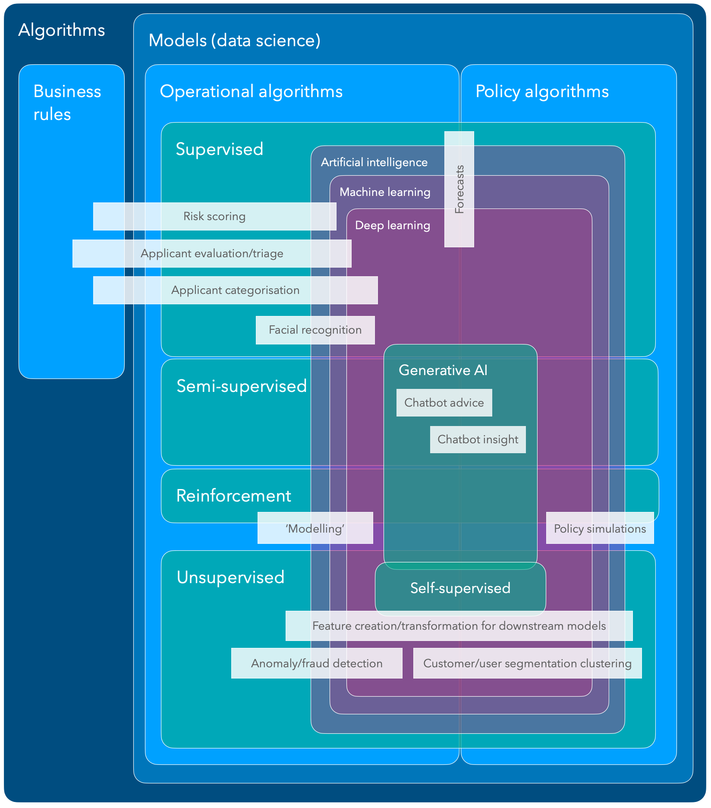
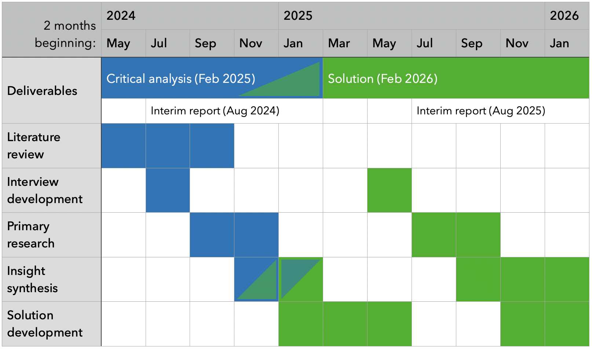

# Improving algorithm safety tools for the New Zealand public sector

Johniel Bocacao

April 2024

## 1. Introduction

As the use of algorithms to inform and improve the operations of businesses increases and becomes increasingly effective, government agencies . Use cases within the New Zealand Government include simple business rules that triage applications, such as passport and visa applications. Other agencies employ more complex mathematical algorithms that influence how individual cases are handled, such as managing criminals more at risk of offending or targeting health support to improve patient outcomes. Algorithms may also inform policy and funding decisions with even more complex models that integrate data of individuals from different government agencies, such as evaluating the wider social outcomes of certain policy programmes. _(StatsNZ, 2018)_ These algorithms help agencies make evidence-based decisions from the insights unlocked by modern data analytics. Algorithms can reduce the inevitable subjectivity and risk of manual decisions made by humans that can be more prone to error, and more difficult to systematically interrogate to understand what (such as biases) affects a decision they reach.

Algorithms are never perfect; it is not inevitable that algorithms will always improve outcomes. There is always a risk that algorithms make incorrect decisions to the detriment of individuals that, for example, miss health interventions after they were needed. The importance of making accurate decisions is compounded for government agencies who have a monopoly on these services, from entry to the country to the legal use of force. Furthermore, a liberal democracy like New Zealand has processes that hold agencies accountable for decisions they make. These include hard levers like legislation that facilitate the right to information held by an agency and enforce expectations on how individual information can be used to protect their privacy. There are more indirect soft levers like the risk of losing social license for agencies that consistently make suboptimal or incorrect decisions, to the point where certain communities could accuse an agency of bias against them. The general public may also hold concerns about the cold automatic nature of machine-based decisions, devoid of the intuition and empathy that comes from a human decision-maker. This risk of losing social license materialises in, for example, people becoming more hesitant to access government services, and becoming worse off as a result.

### 1.1. Research Motivation

To maintain public confidence in how agencies operate and use individual data, the Government Chief Data Steward (GCDS, role held by StatsNZ) and the Government Chief Digital Officer (GCDO role held by the Department of Internal Affairs) (hereafter both known as Joint System Leads) initiated work in 2018 to streamline the New Zealand Government's approach to "ensur\[ing\] algorithms are used appropriately, are used ethically, and free from bias" _(Milicich & Occleshaw, 2018)_. A stocktake of government agencies determined how and why they used algorithms at the time to inform a set of principles the assure internal and external stakeholders that algorithms are fit for purpose and meet legal and ethical standards _(StatsNZ, 2018)_. These principles were embedded in the Algorithm Charter for Aotearoa New Zealand, a non-binding commitment by signatory agencies to comply with said principles, inculcated in each agency through enterprise policies and procedures. The full text is replicated in Section <a href="#80c5e210-ea41-11ee-9b93-53f888f67cff">2.2</a> below.

After 12 months, the Joint System Leads commissioned an independent review to evaluate if its intended aim of improving agency transparency was achieved, ensuring that they weren't stifled in terms of innovation or added compliance burdens. Aspects of the charter excluded from the review included reviewing the text and the voluntary nature of the charter. Findings from interviews and questionnaires were synthesised into common themes and actions, which have been picked up by StatsNZ to implement _(Taylor Fry, 2021)_. This research aims to pick up where StatsNZ left off and seize opportunities to solve already identified gaps in the operationalisation of the Algorithm Charter. My research may also involve identifying opportunities to streamline algorithm development and governance in the New Zealand public sector in general, and critically evaluate how new technological and regulatory developments since the Charter's publication may affect how algorithm governance here should be approached.

At the lowest level of the algorithm development process, the Algorithm Charter requires that "data is fit for purpose by understanding its limitations \[and\] identifying and managing bias". While this consideration will already be part of the processes of agencies with mature algorithm development capability, and may vary considerably depending on the nature of the business problem, there is a case for providing further guidance in operationalising this principle. The main issue agencies have with giving effect to this principle is that they have "struggled to find the expertise to resolve" the issue of quantifying bias and fairness is multi-dimensional issue _(Taylor Fry, 2021)_.

Different definitions need to be considered to reach a balanced, holistic idea of algorithmic fairness, such as empirical impartiality, different types of equality, and consistent application of an algorithm ensuring it is used fairly. Methodologies and tools to help agencies navigate this requirement and make measurement as easy as possible will help agencies grapple one of the most important technical requirements the Charter asks of its signatories. Other benefits for providing better guidance around this principle include:

- Developing a minimal standard set of performance measures, both for the data and the algorithm where applicable, provides a consistent benchmark to readily assure stakeholders (from internal governance advisors to the general public) that an algorithm is fit for purpose.
- Setting this gold standard for measuring fitness can help agencies early in their algorithm maturity to embed best practices during model development and governance.
- Clarifying the importance for monitoring algorithms on an ongoing basis can ensure the data and algorithm continues to be fit for purpose and bias is managed. The importance of regular peer review is acknowledged in the 'privacy, ethics and human rights' principle, but this consideration is vital for the entire algorithm development lifecycle.

Measuring and balancing bias will also contribute to helping agencies navigate another issue in implementing the Charter. Some agencies have anecdotally struggled with giving effect to the 'people' principle of the Charter, engaging people and communities that are interested and impacted by the deployment of algorithms. Some agencies already engage interested communities, such as the Ministry of Business, Innovation and Employment's (MBIE) Data Science Review Board engaging external experts to provide advice and oversight on algorithm development and management. This group is easier to engage by virtue of their active interest but also of their technical expertise. Other impacted communities do not share such a level of expertise, requiring a different way of communicating and engaging. Moreover, the most impacted communities often have the least influence despite knowing what works best for them. Suboptimal communication and engagement may result in poor outcomes for both parties. For example, confusing communication by an agency may leave communities even more concerned, or communities may not be asking the right questions or request changes that aren't possible in the algorithm development process or result in performance tradeoffs elsewhere.

One such impacted community has a separate principle in recognition of their unique relationship with the Government – Māori, while simultaneously ignoring fiduciary obligations imposed by Māori in establishing the Government. Legal precedent _(Waitangi Tribunal, 2021)_ recognises Māori sovereignty of Māori data and mātauranga (knowledge). This obligation (Māori data sovereignty) is noticeably absent from the Charter, which opts to align with other Crown regulatory instruments by calling for consistency with the principles of the Treaty of Waitangi. Clarification is needed around what principles are relevant to the Charter. From there, agencies need guidance around giving effect to those principles. Guidance could also help align the algorithm development process to related frameworks, such as StatsNZ's Ngā Tikanga Paihere, Te Mana Raraunga's Charter principles, and recently emergent Māori algorithmic sovereignty principles _(Brown et al., 2023)_.

Underpinning all the Charter principles is a commitment to transparency. While the wording of the transparency principle itself is limited in its scope (make sure you can explain how a decision was reached), the Charter's supporting text makes clear the importance of "demonstrating transparency... in the use of data" more generally. Transparency provides the only vehicle for accountability due to the voluntary nature of the Charter. As a result, enough information needs to be disclosed by each agency to assure stakeholders that they are meeting the obligations they signed up to. A wide range of stakeholders would have an interest in what and how information is made transparent:

- The general public only need high-level assurance that agencies are complying
- Priority communities (such as ethnic minorities, gender and sexual minorities, domain-specific minorities like people with disabilities) need specific assurance that algorithms don't contribute to detrimental outcomes for them.
- Technical experts need to be able to verify this high-level assurances with access to comprehensive measures and metadata.
- Enterprise gatekeepers (e.g. governance andrisk) need assurance that algorithms align with their strategic objectives, and have controls in place that manage risk. Technical details may need to be translated to better enable this assurance.
- Algorithm developers (or contract managers if externally procured) themselves need assurances that the algorithm is fit for purpose and compliant at the highest level of granularity.

Another idea underpinning the Charter's development and evolution is the striking the right balance between transparency and innovation, and adjusting the balance at the right time. This dichotomy is not necessarily zero-sum, but the perception of an added compliance burden – particularly recognising the contemporaneous fiscal and resource constraint – can limit the success of further efforts.

One significant issue with the Algorithm Charter – better clarity around where the Algorithm Charter applies – has largely been resolved since the Year 1 review with the release of the Algorithm Impact Assessment (AIA) toolkit _(Data.govt.nz, 2023)_. However, this clarified definition has expanded the definition beyond the original intent of the design of the Charter. Some of this expansion is a response to new technologies, like generative artificial intelligence (GenAI). GenAI is significantly different to the state-of-the-art algorithms used by the public sector at the time the Charter was drafted, which were only discriminative (making decisions). GenAI generates novel content, over different mediums from text to images to music, with sophistication and nuance comparable to human creation.

GenAI, through products like ChatGPT or foundational models augmented with subject matter expertise, is capable of providing more complex decisions than traditional predictive analytics, which only provides a number or a choice over a finite set of options. GenAI is also increasingly integrated into existing enterprise solutions like Microsoft Copilot within Microsoft Office, making decision-making provenance more difficult. As such, this development inevitably calls into question whether the Algorithm Charter principles remain fit for purpose, drafted in a time where predictive analytics was the state-of-the-art in the public sector.

### 1.2. Research Objectives

My research seeks to streamline algorithm safety, governance and transparency processes within the New Zealand public sector. New guidance and processes will be informed by the latest academic literature. They will also align with existing regulatory tools, primarily the Algorithm Charter, where existing tools are still fit for purpose.

The first phase of this research will conduct a critical analysis around the current state of algorithm governance within the New Zealand public sector. This phase will involve understanding the primary experiences of the different personas that use the Algorithm Charter. The state of play will also be evaluated against best practices in the latest literature both nationally and globally. The methodology for this first phase is outlined in section <a href="#a0ea7d80-ea41-11ee-9b93-53f888f67cff">3</a>. The scope of this analysis will be comprehensive, analysing how agencies currently and offering recommendations on how an agency should:

1. decide on which of its algorithms are subject to the Charter, with a view to evaluating the new AIA definition and whether the existing principles are fit for purpose in the era of GenAI.
2. measure the 'fitness' of data that informs the creation of algorithms, and the fitness of the algorithm itself. 'Fitness' includes measures of fairness and bias, in addition to traditional performance metrics. 'Fitness' may also include the presence of process controls to align with Charter principles. Section <a href="#ed956970-f4a4-11ee-940a-9b22148b157d">2.3</a> gives a complete definition of algorithmic fitness.
3. adhere to the principles of the Treaty of Waitangi.
4. communicate the use of algorithms to impacted communities and other stakeholders throughout the algorithm development lifecycle.
5. communicate the value proposition of and safeguards around a developing algorithm to decision-makers.

The second phase of this research will devise a technical solution that integrates some of the opportunities identified in the critical analysis. This technical solution should abstract out a minimal set of technical evaluations (tailored to particular prediction types) around the algorithm and the data used to inform its construction. The solution could also be flexible and provide the ability to add or swap out other evaluation modules that a developer believes is useful for a particular business problem, such as a different measurement of fairness. Establishing a minimal set of measurements and providing it in a package that applies methodologies systematically, impartially and consistently will:

- create 'gold standard' patterns that decision-makers can have confidence in when evaluating an algorithm's safety, with different patterns for different types of algorithms
- a consistent benchmark for interested external parties to hold agencies accountable around their use of algorithms
- minimise compliance burden for data scientists by slotting in seamlessly at the end of algorithm development or iteration, as well as evaluate existing algorithms.
  - Process controls (such as measures taken to ensure human oversight, protect privacy, ethics and human rights, engage communities and Treaty partners) could also be embedded into the solution outputs. Such a feature would allow the model code to self-document its controls, removing further compliance burden like forms. The controls can also be version controlled simultaneously as the code changes to give effect to those controls.
- raise concerns around an algorithm's compliance with the Charter if this solution is unable to interrogate it. Thus, a solution should cover as many model environments as possible, or provide an ability to manually evaluate the algorithm outside of its environment.

This solution should produce an output flexible enough to serve multiple user personas:

- The general public, to avoid overloading them with information, a solution may have a high-level health check against each principle with no further detail.
- Priority communities, to allay concerns around the impact for themselves should be able to break down measures by certain population groups.
- Technical experts may be interested in further details than a high-level health check provides, and want to drill down into the supporting measures like fairness measures.
- Enterprise gatekeepers will have a framework to guide discussions around algorithms they are being asked to approve.
- Algorithm developers will have an easy way of comparing model options, observing, for example, the tradeoff between fairness and performance with different methods of minimising bias, or the tradeoff between compliance and performance with models of varying complexity.

### 1.3. Limitations

The user persona segmentation outlined in this research proposal is based on my initial understanding of the important players. The application of design methodologies during primary research may reveal more personas or subcategories of personas. For the purposes of my research, I will focus on two personas: the general public (also the superset of all priority communities), and enterprise gatekeepers. These two personas require more thoughtful design consideration than experts and developers who have the technical capability to know what to look for.

Nevertheless, user testing for algorithm developers can be conducted from an integration perspective rather than a design perspective, ensuring it works in different environments and toolchains. This consideration is potentially another limitation of the research outcome, as I have made the assumption that models operate in a flexible environment where it can be monitored (e.g. performance on new hold-out data. Some models are baked into the business systems themselves. However, it may remain a limitation in order to uncover this issue within organisations, as a failure to regularly review algorithms contravenes the Charter.

In this research, algorithm evaluation is restricted to evaluating traditional quantitative performance and equity measures. Future research may investigate qualitative evaluation of algorithms to understand how they impact the outcomes of individuals and communities, or how traditional policy evaluation methodologies can be augmented when policy initiatives involves algorithms (e.g. Ministry of Education's Equity Index, Social Investment).

Future research may also investigate how the processes surrounding algorithm use are evaluated, such as the efficacy of human oversight measures in mitigating automation bias, or ensuring that the use of algorithms – however unbiased it itself is – is applied in an unbiased manner.

## 2. Background

### 2.1. Algorithms and their role in the public sector

The definition of an algorithm has evolved over time as technology simultaneously evolved. Before the dawn of computing, an algorithm was only considered to be any methodical set of instructions that acts on a variable input to compute an output, and remains a standard basic definition of an algorithm today _(Cormen et al., 2001)_. The Algorithm assessment report _(StatsNZ, 2018)_ refined this definition in the context of modern data analytics, considering only algorithms that "use previously collected data and learn statistical rules that can predict \[likely\] outcomes". StatsNZ outline three categories of algorithms based on what function of government they serve:

1. Operational algorithms: directly employed in the provision of government services to individuals or groups, interpreting their information to inform or deliver a decision that affects them, such as determining one's eligibility for a service, or triaging cases to prioritise the utilisation of resources or match them to resources better suited to a particular case.
2. Algorithms used for policy development and research: informs how government policy is developed and what effect it might have on individuals, groups and the relevant systems, such as forecasting its financial cost and benefits, or modelling or simulating its systemic impact (e.g. traffic congestion, carbon emissions).
3. Business rules: a decision-making process created manually to define or constrain internal business operations.

StatsNZ's 2018 definition of an algorithm more closely matches the data science definition of a model: a collection of learnt mathematical rules (i.e. model parameters). In computer science, an algorithm is the typically refers to the procedure which can be understood logically, independently of a machine _(Yanofsky, 2010)_, and can also include the procedure for learning the rules on top of the predictions themselves. Data scientists typically classify models based on how the model parameters were learnt:

- Supervised learning teaches models how to predict an output (a number, a yes/no, or a multiple-choice category) based on input data and the correct corresponding output.
- Unsupervised learning constructs models based on the underlying structure it determines from the data without knowing a correct output.
  - Self-supervised learning involves generating its own 'correctness' signal, such as how well a lower-dimensional representation of the data can be reconstructed to its original representation.
- Semi-supervised learning combines aspects of the first two. For example, large language models typically employ unsupervised or self-supervised learning to learn its foundational understanding, and fine-tuned with supervised learning.
- Reinforcement learning teaches agents how to decide the best action(s) to take based on observing its environment, rewarding good decision-making policies.

Figure 1 demonstrates the overlap across the two dimensions of algorithm categorisation, as well as the overlap between terms from artificial intelligence (AI), a broad set of technologies that emulate the intelligence of humans. A subset of AI is machine learning, which learns how to predict outcomes or perform tasks from existing data. A subset of machine learning is deep learning, which involves a much greater degree of complexity and often layering techniques over the same or other techniques. A subset of deep learning is GenAI as explained above, employing methods from different types of learning, from self-supervised learning of its foundational understanding, to reinforcement learning from human feedback. Examples are shown in white, which are also overlaid across the definitions to demonstrate how they may fall into multiple categories in different use cases and complexity.

|                                                                                                                         |
| -------------------------------------------------------------------------------------------------------------------------------------------------------------------------------------------------------- |
| Figure 1 - Euler diagram of algorithm categories. StatsNZ's categories are shown in blue, data analytic model categories are in teal, and artificial intelligence categories in purple. Author supplied. |

The Algorithm Charter deliberately avoids prescribing a definition of an algorithm. The rationale for, their approach, and the issues arising from this decision are outlined in the next section.

### 2.2. Algorithm Charter of Aotearoa New Zealand

The current Government algorithm safety work programme began with the development of "Principles for safe and effective use of data and analytics" jointly by the _Privacy Commissioner & Government Chief Data Steward (2018)_. Six principles were developed to guide thinking in the use of data and analytics for decision-making. These principles were the foundation of the final Algorithm Charter principles (see Appendix <a href="#95e47e80-fad2-11ee-940a-9b22148b157d">2</a> for a comparison), along with privacy, ethics and human rights considerations inherited from MSD's PHRaE (detailed in section <a href="#ae931540-ea42-11ee-a0c8-a7de37643b5c">2.4.3</a>).

These principles were also used to assess examples found in a survey of government use of algorithms later in 2018. The Algorithm Assessment Report _(StatsNZ, 2018)_ found variable compliance with said principles, with the weakest compliance in less straightforward principles like "Maintain transparency" and "Understand the limitations" like bias. The report made several recommendations which were addressed by the GCDS in three ways:

1. The inculcation of algorithmic safety principles in an Algorithm Charter
2. A Data Ethics Advisory Group draws external expertise to inform government use of data and analytics
3. Establishing a professional development programme for building technical and ethical skills in government data practitioners.

The first iteration of the Algorithm Charter was launched for public consultation in October 2019, which was met with strong public support _(StatsNZ, 2020)_. Public submissions also supported its ability to make safeguards consistent across agencies, but many flagged the need for better protection of Māori interests, practical implementation guidance, and an emphasis on regular review of algorithms, and of the implementation of the Charter itself. Many also disagreed on limiting the scope of the Charter to operational algorithms.

In response to the feedback, the Charter was revised to better align with the 2018 Principles, strengthened and generalised considerations around community engagement, and increased its accessibility in plain English. Other concerns around implementation guidance and review processes were deferred as new algorithms are developed in line with its commitments, noting that the Charter was "not designed to be a technical document" but a public commitment. The scope of the Charter was initially expanded to all new algorithms, then all algorithms after five years of implementation. However, many government agencies raised concerns about the compliance burden that would impose. A compromise solution was developed based on an algorithm's risk, compelling agencies to always apply the Charter to any algorithm in high-risk scenarios, with less compulsion as risk decreases _(StatsNZ, 2020)_. This risk is self-assessed by each agency, trusting that agencies already "have the best interests of the public in mind and have the most subject matter expertise to make effective judgements about risk of harm to New Zealanders". The Charter also committed the GCDS to conduct a review after one year of its signing.

The one-year review focused on ensuring the existing Charter text (amendments were out of scope) was meeting its intended purpose: "improving government transparency and accountability without stifling innovation or causing undue compliance burden" through interviewing and collecting data on practitioners that utilise the Charter. The review made multiple recommendations, some of which have already been addressed by StatsNZ. However, others have not had any progress based on publicly available knowledge:

- Ensure the possible value of algorithms is also captured in the risk assessment.
- Form guidelines and principles for bias assessment, and how to use software libraries to evaluate bias, and interpreting algorithm outputs.
- Provide concrete examples in a detailed guidance whitepaper on what the partnership commitment looks like in algorithm development.
- Develop an annually updated register of algorithms covered by the charter, which should encourage compliance and best practice.

### 2.3. Algorithm Fitness

Algorithm fitness\[^1\] is the term this research will use to describe a holistic view of whether an algorithm is suitable for use in the public sector. This term calls back to the Charter which compels agencies to ensure that data used to inform algorithm development "is fit for purpose". The Charter offers two ways of achieving this, by:

- understanding its limitations.
  - One important limitation is the accuracy of the data. Human, systematic and random error can reduce accuracy. The extent of an issue could be measured by outlier tests or calculating the proportion of missing data points.
  - Another important limitation is representation of the expected population. A dataset could under-represent certain groups, which usually leads to worse algorithm accuracy for those under-represented groups. A goodness-of-fit test can be employed to measure this issue.
- identifying and managing bias. This aspect of fitness materialises in fairness measures, which will help identify bias at a high level. The success of bias management is borne out in better fairness measures. The Ministry of Social Development's (MSD) Model Development Lifecycle offers multiple definitions of algorithm fairness across different groups:

| Equality type, equality of... | Description, all groups...                                                                   | Measure being equalised                    |
| ----------------------------- | -------------------------------------------------------------------------------------------- | ------------------------------------------ |
| Assessment                    | Assessed the same way                                                                        | Model parameters                           |
| Outcome                       | Have the same rate of being correctly predicted                                              | Accuracy                                   |
| Opportunity                   | Have the same rate of being correctly accepted or opted in                                   | True positive rate                         |
| Odds                          | Have the same rate of being incorrectly accepted or opted in and as above (i.e. false alarm) | True positive rate and false positive rate |

Table 1 - Types of equality according to MSD's Model Development Lifecycle

The rest of the Charter can be interpreted as a way to ensure that the algorithm itself is fit for purpose, bringing the idea of Charter compliance as another aspect of fitness. Transparency around Charter compliance may require:

- a demonstration of how Te Ao Māori was embedded, and the principles of the Treaty of Waitangi was considered, in algorithm development
- a demonstration of how communities of interest were engaged during development
- an outline of privacy, ethics and human rights safeguards, including how data are collected, secured and stored
- clearly explaining the role of humans in decisions informed by algorithms

Finally, there are considerations of algorithm fitness that are part of any typical development process:

- algorithm performance. This aspect is integral in understanding how effective the algorithm is at solving a particular problem. Different performance measures will be suited to different problem definitions. Another aspect of algorithm performance involves balancing its predictive power on available data, and generalisation power with future unseen data.
- ongoing fitness. The fitness of an algorithm deployed over a period of time may not be the same on fresh data as it was when the algorithm was developed. Algorithms risk suffering from data drift, when the characteristics of new input data change as the algorithm remains constant; and concept drift, when the relationship between the input data and the decision changes. A fit algorithm should have controls in place to alert developers to a need for adjusting it.

### 2.4. Relevant Legislation and Policies

Levers available to the government to enforce algorithm safety can be broken into two categories. Acts of legislation are hard levers that compel agencies with certain obligations, with legal consequences when they are not met. Policies are softer levers that come from top-down directives sponsored by the executive within an agency, or a system lead across multiple agencies. Consequences of non-compliance are less severe if policy expectations aren't linked to statutory obligations, usually limited to reputational damage.

#### 2.4.1. Official Information Act

Under this legislation, anyone (including corporations) resident in New Zealand (and non-residents with NZ permanent residency or citizenship) has the right to certain information held by a government agency: "official information". This includes information that "enable\[s\] their more effective participation in \[policymaking\] and promote the accountability of \[the Government\]", as well as personal information about the requester. Section 23 specifically enables the right to access the reasons for why an agency reached a decision that affect that person. This section has implications for agencies that automate decision making; agencies need to be able to explain how such an automation reached that decision.

Official information can be withheld for matters of national security, maintenance of the law, the safety and privacy of any person, economic stability, commercial sensitivities, confidentiality agreements, health and safety, legal privilege, among other reasons that relate less to the provision of personal official information. This consideration is one such "lawful restriction" that prevents the disclosure of algorithm details under the Transparency principle.

#### 2.4.2. Privacy Act

This legislation provides a framework that protects individual privacy, outlining the responsibilities of all organisations, including government agencies, that collect data from individuals and store, use or share them. Some of the 13 information privacy principles in the Privacy Act are relevant in algorithm governance:

- Principle 9 - agencies must not keep personal information for longer than is required. Algorithms should not be developed from information held longer than necessary.
- Principle 10 - agencies "may not use the information for any other purpose" than the purpose which rationalised the collection of information. Thus:
- Principle 3 - individuals need to be aware of "the purpose for which the information is being collected".

The Privacy Act also has provisions for individuals accessing information held by an agency about them. The Privacy Act has more limited withholding grounds than that of the Official Information Act _(Privacy Commissioner, 2013)_, but does not have an explicit right to an explanation of decisions.

#### 2.4.3. Internal Agency Frameworks

Some agencies, particularly those with more mature data governance processes, have developed internal guidance on best practice around the use of data and analytics.

MSD has developed the Privacy, Human Rights and Ethics framework (PHRaE) to govern the collection, use and disclosure of personal data _(Ministry of Social Development, n.d.)_. This framework encourages developers to interrogate the implications of data use on:

- an individual's privacy, such as whether it is necessary to use this information, can we legally use the information already collected given the initial purpose it was collected for, and maintaining the right to access and protections around sharing it.
- an individual's human rights, such as the likelihood of discrimination against certain groups.
- overarching ethics, such as determining the likely benefits and harms and to whom

MSD has also developed the Model Development Lifecycle framework (MDL) to serve as a playbook for developing and maintaining operational algorithms, which also helps MSD meet their commitments to the Charter _(Ministry of Social Development, 2021)_. The MDL has two main tools:

- Data Science Guide for Operations helps data scientists through the entire data science process, from ideation, model selection, data preparation, fairness evaluation, risk/harm management, business user consultation to ongoing model and process maintenance.
- Governance Guide helps enterprise decision-makers identify and mitigate risk across multiple independent "approval gates" to further ensure comprehensive risk management.

The Data Protection and Use Policy (DPUP) developed by the Social Wellbeing Agency has been adopted by the GCDO as a model for "doing the right thing... when collecting or using people's data and information" _(Digital.govt.nz, 2022)_. This framework builds on the obligations set out in the Privacy Act to provide specific guidance in a government setting. DPUP sets out five principles:

- He Tāngata - the use of data improves people's lives and life outcomes
- Manaakitanga - the use of data respects and upholds the mana, dignity and cultural perspectives of all people
- Mana Whakahaere - give people control, choice, access and oversight over their information
- Kaitiakitanga - agencies protect people's data, they don't own them.
- Mahitahitanga - work collaboratively with others, both the communities whose data you protect, and other agencies to minimise duplication.

#### 2.4.4. Frameworks from Civil Society

_Brown et al. (2023)_ provides a framework for translating the guidance within each of the six Māori data sovereignty principles for algorithm development:

- Rangatiratanga – Māori have the right to control the development and use of an algorithm in a way that empowers their self-determination, including motives, management, and storage jurisdiction.
- Whakapapa – Māori are aware of all aspects of the data throughout the algorithm flow, and its use provides wider benefits to the environment the data originates.
- Whanaungatanga – the perspective of the collective needs to be considered along with that of the individual, and recognise the Tiriti principle of the right to redress, to challenge the outcome of an algorithm.
- Kotahitanga – algorithms enable Māori to derive both individual and collective benefits and minimise harm.
- Manaakitanga – the use of algorithms respects and upholds the mana and dignity of Māori, including their privacy and informed consent.
- Kaitiakitanga – Māori are enabled to act as kaitiaki (loosely translated as protectors) of all aspects of the algorithm, with tikanga (including deeming inputs and outputs as tapu/restricted or noa/accessible), kawa and mātauranga underpinning this protection.

#### 2.4.5. Summary

These acts of legislation and frameworks illustrate the regulatory and policy environment that developers in the public sector operate in. The levers that predate the Algorithm Charter also help us understand where the obligations for Charter principles originate from. There is some overlap between these instruments, setting similar expectations but with generalisations and nuances for the particular use case the instrument is regulating.

My research seeks to integrate the expectations across each instrument, as well as best practice from academic literature, the private sector, and other overseas regulatory instruments. This integration will help developers navigate their expectations without having to manage and understand different regulations. How developers have met these expectations can then be documented in the final technical solution.

## 3. Timeline

|       |
| -------------------------------------------------------------------------------------- |
| Figure 2 - Proposed work, spanning 22 months due to the part-time nature of this work. |

### 3.1. Primary research

I will undertake interviews to inform how this project will meet the stated research objectives. Interviews will be conducted over a variety of public sector agencies, and over the most important personas selected in section <a href="#fcbd11c0-fa24-11ee-940a-9b22148b157d">1.3</a>. The interview script will be devised in the first two months of this stage, and conducted over the subsequent four months.

For important subject-matter experts that are time poor or are otherwise unable to be interviewed, a questionnaire can be devised to allow insight to be extracted from them.

Ethics approval for conducting interviews and other primary data collection will be sought.

### 3.2. Insight synthesis

Learnings from the primary research, supplemented with desktop literature research as needed, will be integrated into two written deliverables. The first will be the critical analysis, which will be finished by the end of February 2025 - the halfway point for this project. This analysis will help guide the direction of a range of opportunities to improve the Algorithm Charter. The second will be the thesis, documenting how I contributed to certain opportunities identified in the analysis.

### 3.3. Solution development

Insight from primary research will also be translated into 'system requirements' in the critical analysis. These system requirements will go on to inform the development of a technical solution that acts on identified opportunities. Design methodologies (such as persona segmentation, lean canvassing, user testing) will be employed to apply a end user-centric lens to development. Some of these methodologies involve primary research: user testing on a similar population identified in the first phase. A similar amount of time to the first phase is blocked for primary research in this second phase.

## 4. Resources

### 4.1. Interview Participants

Building a representative sample for collecting information and insight will focus on these characteristics:

- User persona. As identified in section <a href="#747cbdd0-ea41-11ee-9b93-53f888f67cff">1.1</a>, it is important that enough information is collected from each of these personas to understand different perspectives and inform a user-centric solution that serves as many different user bases as possible, rather than a one-size-fits-all solution that fits no user base particularly well.
  - The general public
  - Priority communities
  - Technical experts
  - Enterprise gatekeepers
  - Algorithm developers
- Organisational maturity. It is likely we will get differing insight from users in agencies with established algorithm development processes or otherwise highly capable in algorithm development, compared with users that are at the beginning of the algorithm capability journey.

### 4.2. Stakeholder Engagement

I will keep interested stakeholders apprised of this research to build goodwill and buy-in with both interview participants and important system-level decision makers – whom I will leverage their network and seek potential endorsement. This engagement may involve:

- Updating stakeholders I have identified at key milestones of the research.
- Discussing interesting research found in my literature review or findings from my primary research, in relevant sector newsletters such as future regular comms from the Interim Centre for Data Ethics and Innovation.
- Presenting provisional or final findings to the Algorithm Charter Community of Practice and ACC's Information Governance Group, and other relevant opportunities.

### 4.3. Trial Data for Solution Development

The solution will need trial data to evaluate the solution. This data will likely need to be at the unit record level given the need to evaluate performance for each individual data point within a sample to measure that sample's performance. It will also need access to personal demographic data to evaluate fairness. Solution development should not require access to the model parameters. The solution should only take the feature data, prediction data and model metadata as an input.

Given my employment at ACC, I will request access to ACC claims data and model inferences, and work through what is possible to use in a University environment. Ethics approval for accessing and handling that data will be applied for as needed.

## Appendix 1 - Evolution of all-of-Government algorithm safety principles

| Principles for the safe and effective use of data and analytics (2018)                                                                                                                                                                                                                                                                                                                                                                                                                                                                                                                                                                                                                                                                                                                                                                                                                                               | Draft Algorithm Charter (2019)                                                                                                                                                                                                                                                                                                                                                                  | Final Algorithm Charter (2020)                                                                                                                                                                                                                                                                                                                           |
| -------------------------------------------------------------------------------------------------------------------------------------------------------------------------------------------------------------------------------------------------------------------------------------------------------------------------------------------------------------------------------------------------------------------------------------------------------------------------------------------------------------------------------------------------------------------------------------------------------------------------------------------------------------------------------------------------------------------------------------------------------------------------------------------------------------------------------------------------------------------------------------------------------------------- | ----------------------------------------------------------------------------------------------------------------------------------------------------------------------------------------------------------------------------------------------------------------------------------------------------------------------------------------------------------------------------------------------- | -------------------------------------------------------------------------------------------------------------------------------------------------------------------------------------------------------------------------------------------------------------------------------------------------------------------------------------------------------- |
| **Maintain transparency** - Transparency supports collaboration, partnership, and shared responsibility, and is essential for accountability. This includes ensuring New Zealanders know what data is held about them; how it’s kept secure; who has access to it; and how it’s used. Consultation with stakeholders and Māori as partners ensures manaakitanga (data users show mutual respect), and kaitiakitanga (New Zealanders are mindful of their responsibilities and the communities they source data from), by making sure all data uses are managed in a highly trusted, inclusive, and protected way. Data use and analytical processes should be well documented and in line with all relevant legislation, and state sector guidelines. Explanations of decisions – and the analytical activities behind them – should be in clear, simple, easy-to-understand language.                              | Clearly explain how significant decisions are informed by algorithms and be clear where this isn’t done for reasons of greater public good (for example, national security). Offer technical information about algorithms and the data they use, upon request. Publish information about how data are collected and stored.                                                                     | **Transparency** - Maintain transparency by clearly explaining how decisions are informed by algorithms. This may include: Plain English documentation of the algorithm, Making information about the data and processes available (unless a lawful restriction prevents this), Publishing information about how data are collected, secured and stored. |
| \*\*Deliver clear public benefit - \*\*The use of data and analytics must have clear benefits for New Zealanders. Data and data analytics are tools that support decision-making and it’s essential that in collecting and using public data, government agencies consider, and can demonstrate, positive public benefits. This includes: considering the views of all relevant stakeholders, ensuring all associated policies and decisions have been evaluated for fairness and potential bias and have a solid grounding in law, embedding a te ao Māori perspective through a Treaty-based partnership approach.                                                                                                                                                                                                                                                                                                | Embed a Te Ao Māori perspective in algorithm development or procurement.                                                                                                                                                                                                                                                                                                                        | **Partnership** - Deliver clear public benefit through Treaty commitments by: Embedding a Te Ao Māori perspective in the development and use of algorithms consistent with the principles of the Treaty of Waitangi.                                                                                                                                     |
| **Focus on people -** Keep in mind the people behind the data and how to protect them against misuse of information. It‘s essential to consider the privacy and ethical implications of any analytical process that draws on data collected about people, as using data and analytics for decision-making can have real-life impacts. Consider the methods used to protect personal identifying information and preserve the security of any output. Combining multiple anonymous datasets can re-identify individual people. Personal information should only be kept for as long as necessary.                                                                                                                                                                                                                                                                                                                     | Identify and consult with groups or stakeholders with an interest in algorithm development. Ensure that the perspectives of other communities, such as LGBTQI, Pasifika and people with disabilities are taken into account.                                                                                                                                                                    | **People** - Focus on people by: Identifying and actively engaging with people, communities and groups who have an interest in algorithms, and consulting with those impacted by their use.                                                                                                                                                              |
| \*\*Ensure data is fit for purpose - \*\*Using the right data in the right context can substantially improve decision-making and analytical models, and will avoid generating potentially harmful outcomes. Decision-makers need to be aware of how data is collected and analysed, including the accuracy, precision, consistency, and completeness of data quality, and take special care when re-using data that was originally collected for another purpose. They should also be conscious of analytical models constructed to interpret data, and any automated decision-making occurring as part of this process. Ensuring data and analytical models are fit for purpose will help avoid risks like bias or discrimination.                                                                                                                                                                                  | Not present.                                                                                                                                                                                                                                                                                                                                                                                    | **Data** - Make sure data is fit for purpose by:                                                                                                                                                                                                                                                                                                         |
| \*\*Understand the limitations \*\*- While data is a powerful tool, all analytical processes have inherent limitations in their ability to predict and describe outcomes. These limitations are sometimes not evenly distributed, meaning they can perpetuate or intensify poor outcomes for particular groups. An awareness of these limitations is essential when analysing data. Decision-makers must be fully informed. Developing data capability helps to create depth of understanding and implement the most useful data tools while keeping any limitations in mind. Regular assessments to check for bias and other harmful elements, and address any over-reliance on correlations, are essential in the development and operation of analytical processes. Feeding assessment outcomes back into the design of systems and processes can help ensure unfair or discriminatory outcomes aren’t generated. | Not present.                                                                                                                                                                                                                                                                                                                                                                                    | Understanding its limitations, Identifying and managing bias.                                                                                                                                                                                                                                                                                            |
| Not present.                                                                                                                                                                                                                                                                                                                                                                                                                                                                                                                                                                                                                                                                                                                                                                                                                                                                                                         | Develop or adapt tools and processes to ensure that privacy, ethics, and human rights considerations are considered as a part of algorithm development and procurement. Regularly collect and review data relating to the implementation and operation of algorithms, and periodically assess this for bias or unintended consequences. Have a robust method for peer-reviewing these findings. | **Privacy, human rights and ethics** - Ensure that privacy, ethics and human rights are safeguarded by: Regularly peer reviewing algorithms to assess for unintended consequences and act on this information.                                                                                                                                           |
| **Retain human oversight** - Analytical processes are a tool to inform human decision-making and should never entirely replace human oversight. Ensure significant decisions based on data involve human judgement and evaluation, and that automated decision-making processes are regularly reviewed to make sure they’re still fit for purpose. Decision-makers should approach analytical tools with an appropriate awareness of limitations of data quality and other sources of error. To ensure accountability, decisions based on analytical methods or automated processes affecting people should be openly disclosed, and appropriate review and feedback mechanisms developed to preserve fundamental rights and freedoms.                                                                                                                                                                               | Clearly explain who is responsible for automated decisions and what methods exist for challenge or appeal via a human.                                                                                                                                                                                                                                                                          | **Human oversight** - Retain human oversight by: Nominating a point of contact for public inquiries about algorithms, Providing a channel for challenging or appealing of decisions informed by algorithms, Clearly explaining the role of humans in decisions informed by algorithms.                                                                   |

Table 2

\[^1\] This term is not to be confused with fitness in evolutionary computation; evolutionary fitness would be one quantitative performance measure that informs broader algorithm fitness.

# Bibliography

StatsNZ, .. (2018). Algorithm assessment report 2018 - data.govt.nz. https://data.govt.nz/toolkit/data-ethics/government-algorithm-transparency-and-accountability/algorithm-assessment-report/. 2024-04-08
Milicich, R. & Occleshaw, T.. (2018). Report: Review of Government Algorithms. https://data.govt.nz/assets/Blog-files/Review-of-Government-Algorithms-Report-14-May-2018-for-release.pdf. 2024-04-08
StatsNZ, .. (2018). Algorithm Assessment Report - data.govt.nz . https://data.govt.nz/docs/algorithm-assessment-report/. 2024-04-15
Taylor Fry, P. L.. (2021). Algorithm Charter for Aotearoa New Zealand Year 1 Review. https://www.data.govt.nz/assets/data-ethics/algorithm/Algorithm-Charter-Year-1-Review-FINAL.pdf. 2024-04-13
Waitangi Tribunal, N. G.. (2021). Report on the Comprehensive and Progressive Agreement for Trans-Pacific Partnership. https://forms.justice.govt.nz/search/Documents/WT/wt_DOC_195473606/Report%20on%20the%20CPTPP%20W.pdf. Wellington, NZ
Brown, P. T., Wilson, D., West, K., Escott, K. R., Basabas, K., Ritchie, B., Lucas, D., Taia, I., Kusabs, N. & Keegan, T. T.. (2023). Māori algorithmic sovereignty: idea, principles, and use. arXiv:2311.15473
Data.govt.nz, .. (2023). Algorithm Impact Assessment toolkit. https://www.data.govt.nz/toolkit/data-ethics/government-algorithm-transparency-and-accountability/algorithm-impact-assessment-toolkit/. 2024-04-15
Cormen, T. H., Leiserson, C. E., Rivest, R. L. & Stein, C.. (2001). Introduction to Algorithms. The MIT Press. Cambridge, Massachusetts
Yanofsky, N. S.. (2010). Towards a Definition of an Algorithm. https://doi.org/10.1093/logcom/exq016. 2024-04-15
Privacy Commissioner, N. Z. & Government Chief Data Steward, N. Z.. (2018). Principles for safe and effective use of data and analytics. https://www.privacy.org.nz/publications/guidance-resources/principles-for-the-safe-and-effective-use-of-data-and-analytics-guidance/. 2024-04-15
StatsNZ, .. (2020). Report to the Minister of Statistics: An Algorithm Charter for Aotearoa New Zealand. https://data.govt.nz/assets/data-ethics/algorithm/An-Algorithm-Charter-for-Aotearoa-New-Zealand-watermark.pdf. 2024-04-15
StatsNZ, .. (2020). Report to the Minister of Statistics: Releasing the Algorithm Charter. https://data.govt.nz/assets/data-ethics/algorithm/Releasing-the-Algorithm-Charter-Office-edit.pdf. 2024-04-15
Privacy Commissioner, O. O.. (2013). What’s the difference between the Official Information Act and Privacy Act?. https://privacy.org.nz/tools/knowledge-base/view/183. 2024-04-15
Ministry of Social Development, N. Z.. (n.d.). The Privacy, Human Rights and Ethics Framework. https://www.msd.govt.nz/about-msd-and-our-work/work-programmes/initiatives/phrae/index.html. 2024-04-15
Ministry of Social Development, N. Z.. (2021). Model Development Lifecycle. https://www.msd.govt.nz/about-msd-and-our-work/work-programmes/initiatives/phrae/model-development-lifecycle.html. 2024-04-15
Digital.govt.nz, .. (2022). What DPUP is. https://www.digital.govt.nz/standards-and-guidance/privacy-security-and-risk/privacy/data-protection-and-use-policy-dpup/learn-about-dpup/what-dpup-is/. 2024-04-15